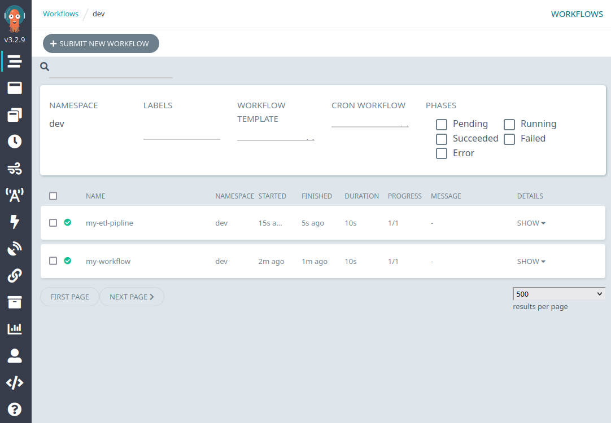

# Argo Workflows

Argo Workflows is an open source container-native workflow engine for orchestrating parallel jobs on Kubernetes. Argo workflows comes enabled by default with Qhub deployments.

## Accessing Argo Server

If Argo Workflows is enabled, users can access argo workflows server at: `your-qhub-domain.com/argo`. Log in via Keycloak with your usual credentials.

Refer to the [Argo documentation](https://argoproj.github.io/argo-workflows/) for further details on Argo Workflows.

## Submitting a workflow via Argo Server

You can submit a workflow by clicking "SUBMIT NEW WORKFLOW" on the landing page.



## Overrides of Argo Workflows Helm Chart values

Argo Workflows is deployed using Argo Workflows Helm Chart version 0.13.1. The values.yaml for the helm chart can be overriden as needed via the overrides flag. The default values
file can be found [here](https://github.com/argoproj/argo-helm/blob/argo-workflows-0.13.1/charts/argo-workflows/values.yaml). For example, the following could be done to add
additional environment variables to the controller container.

```yaml
argo_workflows:
  enabled: true
  overrides:
    controller:
      extraEnv:
        - name: foo
          value: bar
```

## Disabling Argo Workflows

To turn off the cluster monitoring on QHub deployments, simply turn off the feature flag within your `qhub-config.yaml` file. For example:

```yaml
argo_workflows:
  enabled: false
```
